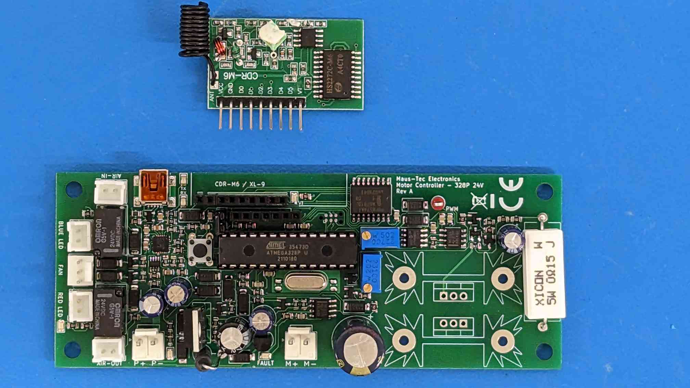

# ATMega328P-Based Tremblr-Compatible Control Board

^- That's a drop-in controller board for Tremblr-like devices. It runs on 23V DC, supports 2 air valves and a DC motor driven 
at ~12KHz PWM, and a 3-wire 24V cooling fan. It's protected by hardware stall detection on both the fan and motor. You can even 
bodge a current sense wire for motor position feedback if you want.

The receiver module is compatible with the original Tremblr remote, and the microcontroller runs this firmware package to 
control everything. The hardware-based stall detection overrides firmware by default and signals a fault to the microcontroller.

This firmware implements both the original remote control and TS-Code over USB Serial.

This board is designed for experimenting and prototyping, and as such you're doing so at your own risk!

## GPIO Allocation

There are two external chips to worry about: One is a digipot to adjust the motor speed connected via SPI, and the other is a 
GPIO extender to interface with the remote, connected via I2C. Basic interaction with these chips is included in this firmware, 
so please reference `main.cpp`, `Hardware.cpp`, and `Remote.cpp` for examples.

PWM Generation is done with a discrete circuit to ensure proper hardware operation. To shut down the control circuit to the 
motor, you must enable the `PWRDN` pin. This signal can be overriden by the hardware fault monitor. If a fault is detected, 
`FAULT` will go high. You can reset the fault state to restore power to the motor by strobing `FCLR` high. Hardware detected
faults will always latch the `FAULT` state and shutdown motor control.

See `PINOUT.h` for pinout constants:

|GPIO|Arduino Pin|Name|Description|
|---|---|---|---|
||4|&lt; `FAULT`|Active HIGH when a hardware fault is latched.|
||5|&gt; `STATUS`|Status (red) LED output.|
||6|&gt; `FCLR`|Strobe this HIGH to reset the fault latch.|
||7|&gt; `PWRDN`|Set HIGH to power down the motor.|
||8|&gt; `AIR_OUT`|Set HIGH to open the Air Out valve.|
||9|&gt; `AIR_IN`|Set HIGH to open the Air In valve.|
||10|&gt; `PWM_SS`|Peripheral Select (active low) for the PWM controller digipot.|

Please note that there is a pin header on the board that exposes the ADC pins for your convenience and exploration pleasure.
The ADC should use the internal voltage reference if used, since that is tied to GND through a 0.1uF capacitor. If you want to
adjust VRef you are welcome to bodge this.

## Contributions

This is supposed to be a barebones example on how to use this board, with minimal connectivity via TS-Code and Remote control.
Contributions should maintain that spirit, and try not to evolve this into any specific use case. However, if it would be
possible to include alternative examples and build targets here, that would be excellent too.